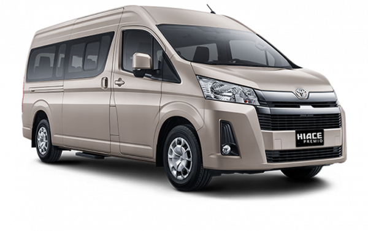
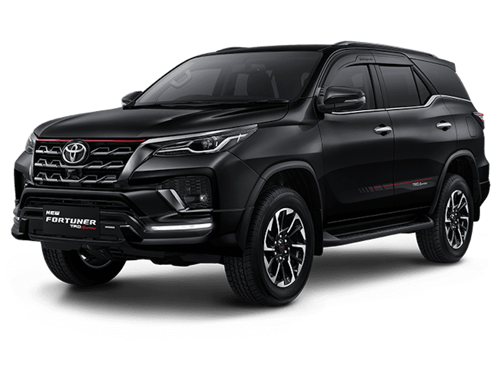

<html lang="en">

<head>
    <meta charset="UTF-8">
    <meta name="viewport" content="width=device-width, initial-scale=1.0">
    <title>Profil Sales Mobil - Andi Irfan Maulana</title>
    <link rel="stylesheet" href="https://cdnjs.cloudflare.com/ajax/libs/font-awesome/6.0.0-beta3/css/all.min.css">
    
</head>

<body>
    <header>
        <h1>Andi Irfan Maulana</h1>
        
Professional Car Sales Consultant

    </header>

    <nav>
        <a href="#about">About Me</a>
        <a href="#services">Services</a>
        <a href="#gallery">Gallery</a>
        <a href="#testimonials">Testimonials</a>
        <a href="#contact">Contact</a>
    </nav>

    

        <section id="about" class="about">
            
            

                <h2>About Me</h2>
                
Hello, I'm Andi Irfan Maulana, a professional car sales consultant with over 10 years of experience in
                    the industry. I specialize in helping customers find the perfect vehicle that meets their needs and
                    budget.

            

        </section>

        <section id="services" class="services">
            

                <h3>Consultation</h3>
                
I offer personalized consultation to help you choose the right car that fits your lifestyle.

            

            

                <h3>Special Offers</h3>
                
Get access to exclusive deals and promotions on a wide range of vehicles.

            

            

                <h3>Test Drive</h3>
                
Schedule a test drive to experience the car before making a decision.

            

        </section>

        <section id="gallery" class="gallery">
            
            
            
        </section>

        <section id="testimonials" class="testimonials">
            

                
                
"Andi is a fantastic consultant. He helped me find the perfect car within my budget. Highly
                    recommended!" - John Doe

            

            

                
                
"I had a great experience working with Andi. He is very knowledgeable and patient." - Jane Smith

            

        </section>

        <iframe class="map"
            src="https://www.google.com/maps/embed?pb=!1m18!1m12!1m3!1d3944.236567848016!2d115.21516501420998!3d-8.67045809093564!2m3!1f0!2f0!3f0!3m2!1i1024!2i768!4f13.1!3m3!1m2!1s0x2dd239d58a14d9f7%3A0xc0f87110a2295c7b!2sToyota%20Astra%20Motor%20Sanur!5e0!3m2!1sen!2sid!4v1613966484090!5m2!1sen!2sid"
            allowfullscreen="" loading="lazy"></iframe>

        <section id="contact" class="contact">
            <h2>Contact Me</h2>
            
Have any questions or need further assistance? Feel free to reach out to me!

            

                
                
                
            

            
Email: andi.sales@example.com | Phone: +62 812-3456-7890

        </section>
    

    <footer>
        
&copy; 2023 Andi Irfan Maulana. All Rights Reserved.

    </footer>
</body>

</html>
