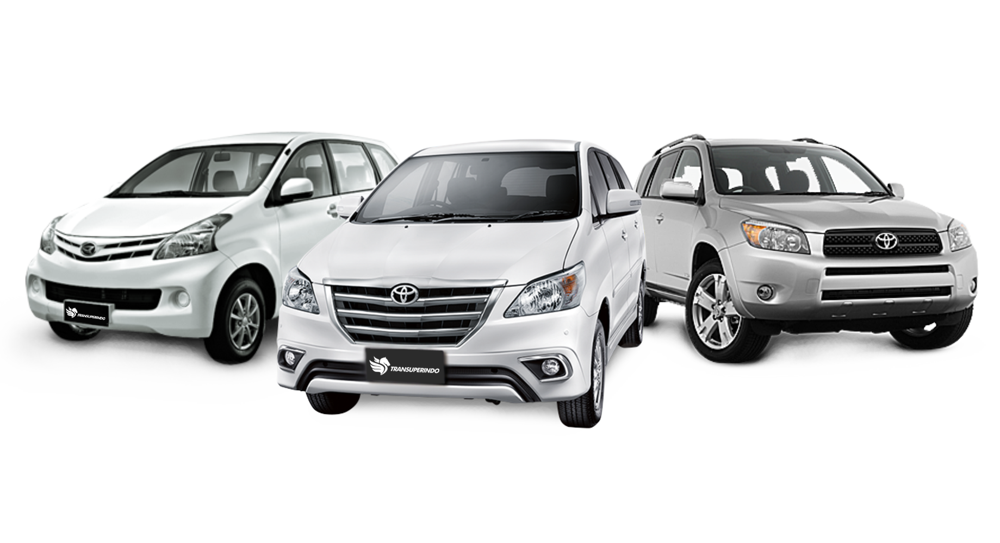

<html lang="en">
<head>
    <meta charset="UTF-8">
    <meta name="viewport" content="width=device-width, initial-scale=1.0">
    <title>Profil Sales Mobil - Andi Irfan Maulana</title>
    <link rel="stylesheet" href="https://cdnjs.cloudflare.com/ajax/libs/font-awesome/6.0.0-beta3/css/all.min.css">
    

    <!-- Background Music -->
    <audio autoplay loop>
        <source src="semangat.mp3" type="audio/mpeg">
        Your browser does not support the audio element.
    </audio>

    <!-- Navigation -->
    <nav>
        <a href="#about">Tentang Saya</a>
        <a href="#services">Layanan</a>
        <a href="#gallery">Galeri</a>
        <a href="#testimonials">Testimoni</a>
        <a href="#contact">Hubungi Saya</a>
    </nav>

    <!-- Header -->
    <header>
        <h1>Andi Irfan Maulana</h1>
        
Sales Mobil Profesional Andalanta

    </header>

    

        <!-- About Section -->
        <section id="about" class="about">
            
            

                <h2>Tentang Saya</h2>
                
Selamat datang di profil saya! Saya Andi Irfan Maulana, seorang sales mobil dengan pengalaman lebih dari 10 tahun dalam industri otomotif. Saya berkomitmen untuk membantu Anda menemukan mobil impian Anda dan memberikan pelayanan terbaik.

            

        </section>

        <!-- Services Section -->
        <section id="services" class="services">
            

                <h3>Konsultasi Pembelian</h3>
                
Saya akan membantu Anda memilih mobil yang sesuai dengan kebutuhan dan anggaran Anda.

            

            

                <h3>Penawaran Terbaik</h3>
                
Saya menyediakan berbagai penawaran dan diskon eksklusif untuk pembelian mobil baru.

            

            

                <h3>Test Drive</h3>
                
Rasakan langsung kenyamanan dan performa mobil pilihan Anda dengan layanan test drive kami.

            

        </section>

        <!-- Gallery Section -->
        <section id="gallery">
            <h2>Galeri Promosi</h2>
            

                
                
                
                
            

        </section>

        <!-- Testimonials Section -->
        <section id="Kerjasama">
            <h2>Kerjasama</h2>
        <section id="testimonials" class="testimonials">
            

                
"Kami bekerjasama dengan beberapa pihak pembiayaan."

                

                    
                    
                    
                    
                

            

        </section>

        <!-- Contact Section -->
        <section id="contact" class="contact">
            <h2>Hubungi Saya</h2>
            
Saya siap membantu Anda. Jangan ragu untuk menghubungi saya untuk konsultasi atau pertanyaan lebih lanjut.

            

                
                
            

            
Alamat: Jln. Tamalanrea BTP , Kota Makassar

            <a href="https://www.google.com/maps/place/Jl.+Kesenangan+3,+Tamalanrea,+Kec.+Tamalanrea,+Kota+Makassar,+Sulawesi+Selatan+90245/@-5.1321812,119.4988383,17z/data=!3m1!4b1!4m6!3m5!1s0x2dbefcb1d60774cb:0x9e04f396881d124a!8m2!3d-5.1321812!4d119.5014132!16s%2Fg%2F1hm64_pkm?entry=ttu&g_ep=EgoyMDI0MDgyMS4wIKXMDSoASAFQAw%3D%3D" target="_blank" title="Lihat di Google Maps">Lihat di Google Maps</a>
            <!-- Embedding Google Maps -->
            <iframe class="map" src="https://www.google.com/maps/place/Jl.+Kesenangan+3,+Tamalanrea,+Kec.+Tamalanrea,+Kota+Makassar,+Sulawesi+Selatan+90245/@-5.1321812,119.4988329,17z/data=!3m1!4b1!4m6!3m5!1s0x2dbefcb1d60774cb:0x9e04f396881d124a!8m2!3d-5.1321812!4d119.5014132!16s%2Fg%2F1hm64_pkm?entry=ttu&g_ep=EgoyMDI0MDgyMS4wIKXMDSoASAFQAw%3D%3D" allowfullscreen="" loading="lazy"></iframe>
        </section>
    

    <!-- Gallery Modal -->
    

        &times;
        
        

    

    <!-- Footer -->
    <footer>
        
&copy; 2024 Andi Irfan Maulana. All Rights Reserved.

    </footer>

    
</body>

</html>
